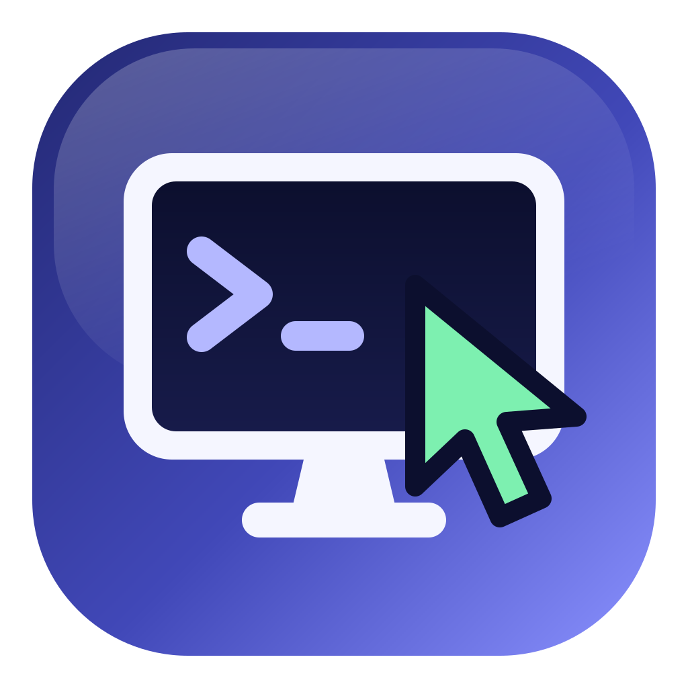

# agentpc

[](LICENSE)


**Instant, resettable Windows and Ubuntu desktops for AI agents, on your Mac.**

Website: <https://agentpc.pawanpaudel.com.np>

agentpc gives AI agents (Claude Code, Claude Desktop, Codex, Cursor, Gemini CLI, VS Code, or
any MCP client) real desktop computers to work in: create a VM in seconds, let the agent click,
type, take screenshots and run commands, then reset it to a clean state. It is a single Rust
binary that runs VMs with QEMU on Apple's hypervisor and serves them to agents over MCP.

## Contents

- [Features](#features)
- [Requirements](#requirements)
- [Installation](#installation)
- [Quick start](#quick-start)
- [Using it with AI agents](#using-it-with-ai-agents)
- [CLI reference](#cli-reference)
- [Images](#images)
- [Configuration](#configuration)
- [How it works](#how-it-works)
- [Troubleshooting & guest tips](#troubleshooting--guest-tips)
- [Uninstalling](#uninstalling)
- [Security](#security)
- [Development](#development)
- [License](#license)

## Features

- **Instant VMs.** New VMs resume from a saved snapshot of a running desktop: ready in
  ~1 s (Ubuntu) or ~4 s (Windows). `reset` returns a VM to a clean state just as fast.
- **Checkpoints.** Save a running VM (disk and memory) before a risky step and return to that
  exact state in seconds.
- **Real desktops.** Windows 11 (ARM) and Ubuntu 24.04 or another release (XFCE), each with a
  desktop-control server agents can drive: [cua-driver](https://github.com/trycua/cua) on both.
- **One MCP server for everything.** Agents create, drive, screenshot and delete VMs
  themselves. Works with any MCP client; `agentpc mcp-install` sets up the popular ones.
- **Shell and screen access.** Run PowerShell or bash over SSH; take PNG screenshots straight
  from the hypervisor in ~40 ms, even while a guest is booting or hung.
- **Files and ports.** Copy files and folders between your Mac and a VM, and reach servers
  running inside a VM from your Mac.
- **Agent-ready guests.** 1280x800 desktops with a browser (Edge on Windows, Chrome on Ubuntu)
  and the pop-ups, update restarts and background jobs that interrupt unattended work turned off.
- **Watch along.** Every VM has a browser viewer, so you can see what the agent is doing.
- **Any version, side by side.** Run Ubuntu 22.04, 24.04 and 26.04, or several Windows 11
  releases, at the same time. Each image records its OS version, source and build date.
- **Local and private.** Everything runs on your Mac and listens on `127.0.0.1` only.

## Requirements

| Requirement | Details |
| --- | --- |
| Hardware | Apple Silicon Mac (M1 or later; tested on M4) |
| OS | A macOS version QEMU supports: the current one and, for up to two years, the previous one (tested on macOS 15) |
| Runtime | [QEMU](https://www.qemu.org) from Homebrew (the installer handles it, installing Homebrew too if needed) |
| Memory | 4 GB per running Ubuntu VM, 8 GB per running Windows VM |
| Disk | ~10 GB per Ubuntu image, ~30 GB per Windows image (each including its snapshot) |

## Installation

```sh
curl -fsSL https://agentpc.pawanpaudel.com.np/install.sh | sh
```

The installer:

1. downloads the latest release and verifies its checksum,
2. installs `agentpc` to `~/.local/bin` (no `sudo`) and adds it to your `PATH`,
3. installs QEMU with Homebrew if it's missing (installing Homebrew first if needed, which
   asks for your password once),
4. registers the MCP server with the agents it finds (`agentpc mcp-install`),
5. checks everything with `agentpc doctor`.

To upgrade later, run `agentpc update` (or `agentpc update --check` to just look); rerunning the
installer works too. Installer options:

| Variable | Effect |
| --- | --- |
| `AGENTPC_VERSION=0.1.0` | Install a specific version |
| `AGENTPC_INSTALL_DIR=<dir>` | Install somewhere other than `~/.local/bin` |
| `AGENTPC_NO_MCP=1` | Skip registering the MCP server |

To build from source instead, see [Development](#development).

## Quick start

**Ubuntu:**

```sh
agentpc create ubuntu        # first run: downloads (~1.2 GB) and prepares the image; then ~1 s per VM
```

**Windows:** Microsoft's license doesn't allow redistributing Windows images, so each Mac
builds its own once. agentpc downloads the official Windows 11 ARM64 ISO from Microsoft
(7.3 GB, checksum-verified) unless you already have one:

```sh
agentpc image build windows    # once: download + ~12 min install; or pass --iso <path>
agentpc create windows         # ~4 s per VM
```

Then ask your agent something like:

- *"Create an Ubuntu VM, open a terminal and run `uname -a`."*
- *"Reset ubuntu-1 and check that my install script works on a clean machine."*
- *"Open Notepad on windows-1, type a short note and show me a screenshot."*

To watch a VM yourself, open the viewer URL printed by `agentpc info <name>`.

## Using it with AI agents

agentpc is an MCP server (`agentpc mcp`, stdio). One server handles every VM.

### Claude plugin

In Claude Code, install the agentpc plugin. It bundles the MCP server with a skill that
teaches Claude when and how to use the VMs:

```text
/plugin marketplace add pawanpaudel93/agentpc
/plugin install agentpc@agentpc
```

The plugin runs the installed `agentpc` binary, so install that first
(see [Installation](#installation)). When the plugin is installed it already registers the MCP
server for Claude Code, so `agentpc mcp-install` skips Claude Code to avoid a duplicate.

### Other agents

**Register it** with every supported agent that's installed (the installer does this):

```sh
agentpc mcp-install                  # or pick: agentpc mcp-install claude claude-desktop codex
```

Supported: Claude Code, Claude Desktop, Codex, Cursor, Gemini CLI and VS Code (restart Claude
Desktop after registering). For any other MCP client, add:

```json
{
  "mcpServers": {
    "agentpc": { "command": "agentpc", "args": ["mcp"] }
  }
}
```

This repository also contains project-level configs (`.mcp.json`, `.codex/config.toml`,
`.cursor/mcp.json`, `.gemini/settings.json`, `.vscode/mcp.json`), so agents opened in a clone
pick the server up automatically.

### Tools

| Tool | Description |
| --- | --- |
| `list_vms` | VMs (owner, state, size, checkpoints, viewer) and the available images with their OS versions |
| `create_vm` | Create a VM (optionally of a given version, size, or offline) and wait until its desktop is ready. Retrying it in the same session returns the VM already created |
| `start_vm` / `stop_vm` | Boot a stopped VM / shut one down cleanly |
| `reset_vm` | Discard all changes: back to a fresh copy of the image |
| `checkpoint_vm` / `restore_vm` | Save a VM's disk and memory under a label; go back to it in seconds |
| `delete_checkpoint` | Delete one checkpoint by label; the VM is untouched |
| `delete_vm` | Delete a VM with its disk and checkpoints |
| `take_screenshot` | PNG screenshot from the hypervisor; `save_to` also writes it to a path on your Mac |
| `run_command` | Run a command (PowerShell on Windows, bash on Ubuntu); returns exit code, stdout and stderr. A foreground run is killed at `timeout` (default 120 s) with partial output; `background: true` returns a job id for `get_job_status` |
| `get_job_status` | Check a background job by its id: still running or exited (with its code), plus the tail of its log |
| `upload_file` / `download_file` | Copy files or folders between your Mac and a VM |
| `forward_port` | Reach a server running in a VM from your Mac (SSH tunnel; works even for servers bound to the guest's own `127.0.0.1`) |
| `list_forwards` / `delete_forward` | List a VM's active port forwards / stop one by its host port |
| `read_vm_log` | Read the tail of a VM's `qemu` or `serial` log, for when a VM won't boot or the desktop is unreachable |
| `list_desktop_tools` | List the desktop-control tools inside a VM |
| `use_desktop_tool` | Call one of them: click, type, launch apps, read the UI tree, … |

VMs an MCP session created or started are stopped (never deleted) when the session ends, unless
`AGENTPC_KEEP_RUNNING=1`.

| Guest | Desktop | Desktop-control server |
| --- | --- | --- |
| Windows | Windows 11 (ARM64), 1280x800, Edge | [cua-driver](https://github.com/trycua/cua) (over SSH; Windows-MCP on images built by 0.1.0) |
| Ubuntu | Ubuntu 24.04 or another release, XFCE on X11, 1280x800, Google Chrome | [cua-driver](https://github.com/trycua/cua) (over SSH) |

[AGENTS.md](AGENTS.md) has usage tips for agents.

## CLI reference

### VMs

Commands that act on VMs take several names (`agentpc stop a b`), check them all before
doing anything, and carry on past a failure (exit status 1 if any failed). Every command has
`--help`.

| Command | Description |
| --- | --- |
| `agentpc create <image> [name] [--memory GB] [--cpus N] [--offline]` | Create a VM from `ubuntu`, `windows` or a version such as `ubuntu-22.04`; fetches Ubuntu images if missing. `--memory` is 2–64 GB, `--cpus` 1–16; a non-default size boots cold instead of resuming. `--offline`: no internet or access to this Mac |
| `agentpc list [--json]` (`ls`) | VMs and images; `--json` gives the same data as the MCP `list_vms` tool |
| `agentpc info <name>` | Viewer URL (with the VNC password), SSH and VNC details, and checkpoints |
| `agentpc start <name>… \| --all` | Boot stopped VMs |
| `agentpc stop <name>… \| --all` | Shut VMs down cleanly; disks are kept |
| `agentpc reset <name>…` | Discard all changes: back to a fresh copy of the image |
| `agentpc rm <name>…` (`delete`) | Delete VMs with their disks and checkpoints |
| `agentpc checkpoint <name> <label> [-d]` | Save a VM's disk and memory (a running VM pauses ~5 s), or delete a checkpoint |
| `agentpc restore <name> <label>` | Put a VM back exactly as it was at a checkpoint (resumes in seconds) |
| `agentpc ssh <name> [command]` | Run a command, or open a shell with no command |
| `agentpc screenshot <name> [file]` | Save a PNG screenshot |
| `agentpc cp <src> <dst>` | Copy files; the VM side is `<name>:<path>`, e.g. `agentpc cp app.msi windows-1:Downloads/` |
| `agentpc forward <name> <guest-port> [host-port]` | Forward `127.0.0.1:<host-port>` to a port in a running VM (over SSH). `--list` shows a VM's forwards; `--rm <host-port>` stops one |

### Image commands

| Command | Description |
| --- | --- |
| `agentpc image pull <image>` | Download a published Ubuntu image, e.g. `ubuntu` or `ubuntu-22.04` |
| `agentpc image build <image> [--iso <path>]` | Build an image locally (Ubuntu ~3 min, Windows ~12 min + ISO download) |
| `agentpc image ls` (`list`) | List local images with their OS versions |
| `agentpc image info <image>` | Version, source, build date and desktop server of an image |
| `agentpc image rm <image>…` (`delete`) | Delete local images |
| `agentpc image snapshot <image>` | Recapture the snapshot VMs resume from (build and pull do this) |
| `agentpc image push <image>` | Maintainers: publish an Ubuntu image to ghcr.io |

### Setup

| Command | Description |
| --- | --- |
| `agentpc mcp` | Run the MCP server on stdio (what agents launch) |
| `agentpc mcp-install [clients…]` | Register the MCP server with agents (skips Claude Code when the plugin is installed; raises Codex's MCP timeouts so slow builds and boots don't trip it) |
| `agentpc mcp-uninstall [clients…]` | Remove it from agents again |
| `agentpc update [--check]` | Update to the latest release (checksum-verified; images and VMs are kept). Alias: `upgrade` |
| `agentpc doctor` | Check prerequisites |
| `agentpc clean [-n]` | Free disk space: downloaded ISOs and cloud images, and leftovers of interrupted builds or checkpoints. Never touches images or VMs; lists images no VM uses |
| `agentpc uninstall [--keep-data] [-y]` | Remove agentpc (see [Uninstalling](#uninstalling)) |
| `agentpc completions <shell>` | Print tab completion for bash, zsh or fish, e.g. `agentpc completions zsh > ~/.zfunc/_agentpc` |

## Images

An **image** is a read-only disk with the OS, desktop and agent tools installed. Every VM is a
copy-on-write clone of an image, so a VM starts from a clean install and costs only a few MB.

Images are named `<os>-<version>`, and several can be installed side by side; each VM
remembers which one it came from. A bare `ubuntu` means `ubuntu-24.04`, and a bare `windows`
(or `windows-11`) means `windows-11-25h2`. To save a 12-minute build, `create` and
`image info` fall back to your newest installed Windows 11 image if 25H2 isn't built. Pin the
full name when the release matters, e.g. in test harnesses.

| Image | Source | How to get it |
| --- | --- | --- |
| `ubuntu` = `ubuntu-24.04` | Official Ubuntu 24.04 cloud image | `image pull` (automatic on first `create`) or `image build` |
| `ubuntu-<release>` | Any release in [cloud-images.ubuntu.com/releases](https://cloud-images.ubuntu.com/releases/), e.g. `22.04`, `26.04` | `image build ubuntu-22.04`, or `image pull` if published |
| `windows-11-25h2` (`windows`) | Windows 11 25H2 (Home/Pro), 7.3 GB ISO from Microsoft | `image build windows` |
| `windows-11-24h2`, `windows-11-23h2` | Earlier Windows 11 releases (Home/Pro) | `image build windows-11-23h2` |
| `windows-<name>` | Your own Windows 11 ARM64 Home/Pro ISO | `image build windows-<name> --iso <path>` |

Only ARM64 Windows runs at native speed on Apple Silicon, so x64-only releases aren't offered,
and Windows 10's ARM64 build hangs at boot on Apple Silicon, so Windows 11 is the minimum.
The unattended install uses the Home/Pro setup key, so Enterprise and LTSC ISOs aren't
supported. An ISO in `~/Downloads` is used when its file name shows the release being built;
`--iso` with a release name must match it too (a 24H2 ISO can't become `windows-11-25h2`).
Windows runs unactivated (a watermark, nothing else); activate it with your own key if you
need to.

Images are clean installs, like a customer's new PC: Windows has no Visual C++ redistributable,
no .NET (only the built-in .NET Framework 4.8.1) and no PowerShell 7. A program that runs on
your machine but fails in a VM with a missing `VCRUNTIME140.dll` or similar is missing a
dependency its installer should provide. Microsoft's evaluation ISOs aren't offered: they install already expired and shut
down every hour.

Microsoft serves only its current ARM64 ISOs; the older ones download from archive mirrors
(archive.org, bobpony.com). Every ISO is checked against a pinned SHA-256, so a mirror can't
substitute a modified file, and kept in `~/.agentpc/cache`. All are en-us; for another
language, download it yourself and pass `--iso`.

```sh
agentpc image build ubuntu-22.04     # ~3 min
agentpc create ubuntu-22.04          # VMs from different versions run side by side
```

Each image records what it is (`agentpc image info <image>`):

```json
{
  "os": "windows",
  "version": "Windows 11 Pro 25H2 (build 26200.6584)",
  "version_id": "11-25H2",
  "arch": "arm64",
  "base": "Windows 11 25H2 (Home/Pro) ISO, ARM64, en-us",
  "built": "20260927",
  "agentpc": "0.1.0",
  "desktop_server": "cua-driver 0.30.1",
  "iso_sha256": "32cde007…"
}
```

Published images live in one package, `ghcr.io/pawanpaudel93/agentpc`, tagged by image
name. Only Ubuntu is published (Windows images can't be redistributed):

| Tag | Meaning | Pull with |
| --- | --- | --- |
| `ubuntu-24.04` | Newest build of Ubuntu 24.04 (also tagged `ubuntu`) | `agentpc image pull ubuntu` |
| `ubuntu-<release>` | Newest build of another release | `agentpc image pull ubuntu-22.04` |
| `ubuntu-24.04-YYYYMMDD` | One specific build (pinned) | `agentpc image pull ubuntu-24.04-YYYYMMDD` |

## Configuration

| Variable | Default | Description |
| --- | --- | --- |
| `AGENTPC_HOME` | `~/.agentpc` | Where images, VMs, keys and caches live |
| `AGENTPC_IMAGE_REPO` | `ghcr.io/pawanpaudel93/agentpc` | Package for `image pull`/`push` (tagged by image name) |
| `WIN_ISO` | an earlier download, a matching ISO in `~/Downloads`, else a download | Windows ISO used by `image build windows-…` without `--iso` |

Each VM gets its own ports on `127.0.0.1`, derived from its slot number `n` (an existing VM
moves to its new ports the next time it starts):

| Port | Use |
| --- | --- |
| `47000 + n` | SSH |
| `47100 + n` | Windows-MCP (Windows images built by 0.1.0) |
| `47200 + n` | noVNC WebSocket (for the viewer) |
| `47300 + n` | VNC |
| `8100` | Browser viewer, shared by all VMs |

The guest login is `agent` / `agent`. Each VM also has its own VNC password (see
[Security](#security)).

## How it works

- **Hypervisor.** VMs run in QEMU with Apple's Hypervisor.framework (HVF), natively on Apple
  Silicon, with nothing else in between.
- **Instant start.** After building or downloading an image, agentpc boots it once, waits
  until the desktop and its control server are running, and saves the VM's memory. New VMs
  resume from that saved state instead of booting (~1 s / ~4 s instead of ~14 s / ~25 s). A
  `start` after `stop` is a normal boot; `reset` resumes a fresh copy again.
- **Checkpoints.** A checkpoint pauses the VM for a few seconds, writes its memory to a file
  and clones its disk (an APFS copy-on-write clone, so it costs nothing until the VM writes
  more). Restoring resumes from them like a new VM does. Each checkpoint of a running VM
  takes disk space about equal to the memory in use (3–4 GB for Windows); `agentpc checkpoint
  <name> <label> --delete` removes one, and deleting the VM removes all of them.
- **Snapshots stay local.** A memory snapshot depends on the Mac's chip and QEMU version, so
  only the disk is published; the snapshot is recaptured after each pull (about a minute). Each
  snapshot records the QEMU machine type, so it still resumes after a QEMU upgrade.
- **Robustness.** `create` checks free disk and RAM up front and `checkpoint` checks disk;
  restore is atomic (a failed one leaves the VM as it was) and resumes a VM that was left paused;
  operations on one VM are serialized, and a stale pid file from a crash is detected rather than
  trusted. The guest clock follows the Mac's time zone. SSH keepalives hold long calls open, a
  desktop tool call gives up after 120 s, and a viewer that won't start no longer fails a VM
  start. The browser viewer (noVNC) is downloaded against a pinned checksum.
- **Image distribution.** Ubuntu images are OCI artifacts on GitHub Container Registry: a
  compressed qcow2 split into 64 MB parts, downloaded in parallel and checksum-verified.
- **Windows build.** agentpc writes a small setup disk next to the ISO: an unattended-install
  answer file (adapted from [dockur/windows-arm](https://github.com/dockur/windows-arm)), Red
  Hat's ARM64 virtio drivers, and a first-logon script that installs OpenSSH and cua-driver (telemetry off).
  Windows Setup then runs in QEMU with no clicks.
- **Ubuntu build.** The official cloud image is provisioned with cloud-init: XFCE on X11,
  auto-login, and cua-driver (pinned, so tool names match these docs; telemetry off). cloud-init is then disabled so clones don't re-provision. To opt in to cua-driver's telemetry, run `cua-driver telemetry enable` in the VM.
- **Agent-ready guests.** Each time a snapshot is captured, a prepare script turns off what
  interrupts unattended work (Windows SmartScreen, updates, first-run and tip pop-ups; Ubuntu's
  background apt jobs) and installs Google Chrome on Ubuntu for cua-driver's browser tools.

## Troubleshooting & guest tips

- **Check the setup:** `agentpc doctor`.
- **See the screen:** `agentpc screenshot <name>`, or open the viewer URL from
  `agentpc info <name>`.
- **Logs** for each VM are in `~/.agentpc/instances/<name>/`: `qemu.log` (QEMU errors) and
  `serial.log` (guest console).
- **A VM is in a bad state:** `agentpc reset <name>`.
- **`image build`/`pull`/`rm` refuses:** VMs still depend on that image; `agentpc rm` them
  first.

### Networking

Each VM sits behind QEMU's user-mode NAT, so VMs are isolated from each other but share the
Mac's network (a VPN or proxy configured on the Mac applies to a VM's outbound traffic).

- **Reach a server in a VM from the Mac:** `agentpc forward <name> <guest-port> [host-port]`
  (MCP: `forward_port`), then connect to `127.0.0.1:<host-port>`. It tunnels over SSH, so it
  reaches a server bound to the guest's own `127.0.0.1` and the Windows firewall doesn't apply.
  A forward lasts until the VM stops or you remove it (`--rm <host-port>` / `delete_forward`);
  `--list` (MCP: `list_forwards`) shows a VM's forwards.
- **Reach the Mac from a guest:** `10.0.2.2` is the Mac host — the NAT maps it to the Mac's
  loopback, so a dev server listening on `127.0.0.1` or `0.0.0.0` is reachable at
  `10.0.2.2:<port>` from inside the VM.
- **VM to VM:** there's no direct route. Forward the server VM's port to the Mac
  (`forward_port(B, guest_port, host_port)`), then from the other VM connect to
  `10.0.2.2:<host_port>`.
- **Offline VMs** (`--offline` / `offline: true`) can't reach `10.0.2.2` or the internet, but
  ports you forward from the Mac still reach them.
- **Corporate proxy / CA:** a guest inherits no proxy settings from the Mac. Set `HTTP_PROXY`
  and `HTTPS_PROXY` inside the guest, and import your corporate root CA with
  `Import-Certificate` (Windows) or `update-ca-certificates` (Ubuntu).

### Guest reboots

Rebooting a guest (a Windows Update install, some installers) drops the SSH connection. Call
`start_vm` on the same VM — it waits until the desktop is ready again even when the VM is
already running — or simply retry `run_command` once it's back.

### Windows guest tips

- **GUI installers return immediately.** Run them silently and wait for the process:
  `Start-Process installer.exe -ArgumentList '/S' -Wait -PassThru` (the switch varies:
  `/S`, `/silent`, `/quiet`), then check its `ExitCode`. A `run_command` process ends when
  the command returns, so start servers and GUI apps with `background: true`.
- **Windows Update is disabled** in the image (the `wuauserv` service is stopped and set to
  Disabled, and the `NoAutoUpdate` policy is set) so updates never interrupt a task. This also
  blocks optional features that fetch from Windows Update — DISM `/online` (e.g. .NET 3.5) and
  `Add-WindowsCapability` (RSAT, language packs; OpenSSH is already installed). To use one,
  re-enable it temporarily and set it back afterwards:

  ```powershell
  Set-Service wuauserv -StartupType Manual; Start-Service wuauserv
  # … Add-WindowsCapability / DISM …
  Stop-Service wuauserv; Set-Service wuauserv -StartupType Disabled
  ```

- **Defender real-time protection is on.** agentpc only disables SmartScreen, not Defender, so
  Defender may quarantine a freshly built or unsigned test binary. Exclude your work directory
  with `Add-MpPreference -ExclusionPath C:\work`, or turn real-time monitoring off with
  `Set-MpPreference -DisableRealtimeMonitoring $true` (Tamper Protection may block the latter).

### Hardware limits

Guests have a fixed 1280x800 display, a 2D-only virtio GPU (no 3D/GPU acceleration; WebGL is
software-rendered or unavailable), and no audio device.

## Uninstalling

```sh
agentpc uninstall            # asks first; -y skips the prompt
```

This stops all VMs, removes the MCP server from every agent `mcp-install` registered it with,
deletes `~/.agentpc` (images, VMs, checkpoints and keys; `--keep-data` keeps them) and the
`agentpc` binary. It leaves shared things alone and lists them: the PATH line the installer
added (`~/.local/bin` is used by other tools too), QEMU (`brew uninstall qemu` if nothing else
needs it) and the Claude plugin (`/plugin uninstall agentpc@agentpc`).

To only reclaim disk space, `agentpc clean` deletes what can be downloaded again, and
`agentpc image rm <image>` deletes an image you no longer use.

## Security

- Everything listens on `127.0.0.1` only.
- The desktop-control servers inside the VMs are unauthenticated; any process on your Mac can
  reach them.
- Each VM has its own VNC password (`vnc-pass`, mode 0600, in its instance dir). The viewer URL
  from `agentpc info <name>` carries it (`&password=…`) so the browser viewer connects without a
  prompt; a native VNC client (`vnc://127.0.0.1:<port>`) asks for it — copy it from that URL or
  read `~/.agentpc/instances/<name>/vnc-pass`.
- Guests use the fixed login `agent` / `agent`.
- To keep agents unblocked, Windows VMs have UAC prompts, SmartScreen and Windows Update turned
  off. Don't use them for anything that needs those protections.
- VMs can reach the internet and, through its gateway `10.0.2.2`, services on your Mac. Create
  a VM with `--offline` (`offline: true` in `create_vm`) to cut both off, e.g. for untrusted
  software; SSH, the viewer and forwarded ports keep working.
- The MCP tools carry annotations: `list_vms`, `take_screenshot` and `list_desktop_tools` are
  read-only, and tools that discard or overwrite state (including `download_file`, which writes
  to your Mac) are marked destructive, so clients can auto-approve or confirm accordingly.
- Treat VMs as throwaway sandboxes, not as a place for secrets.

## Development

```sh
cargo build --release                  # target/release/agentpc
cargo clippy --all-targets -- -D warnings
cargo test
```

Guest provisioning files in `guests/` are embedded into the binary. [AGENTS.md](AGENTS.md)
describes the code layout for contributors and coding agents.

<details>
<summary>Releasing (maintainers)</summary>

1. On an up-to-date, clean `main`, run `scripts/release.sh X.Y.Z` (needs `gh` logged in,
   Node for `npx`, and `jq`). It sets the version everywhere (skipped when `Cargo.toml` is
   already at X.Y.Z), runs the CI checks, builds `dist/` (binary tarball, MCP bundle
   `agentpc-X.Y.Z.mcpb`, their `.sha256` files, a filled-in `server.json` and `NOTES.md`,
   the release notes grouped from the Conventional Commit subjects since the last tag), then
   asks before it commits `chore: release vX.Y.Z`, tags `vX.Y.Z`, pushes `main` and the tag,
   and creates the GitHub Release. `--dry-run` stops after building `dist/`.
2. Publish the Ubuntu image: `agentpc image build ubuntu`, then log `oras` in with a token
   that can write packages (`gh auth refresh -s write:packages`, then
   `gh auth token | oras login ghcr.io -u <user> --password-stdin`) and run
   `agentpc image push ubuntu`. It uploads 64 MB parts, retries failures and links the package
   to this repo; make the package public once in its settings.
3. Publish to the MCP Registry: `brew install mcp-publisher`, `mcp-publisher login github`,
   then `mcp-publisher publish dist/server.json`.

</details>

## License

[MIT](LICENSE) © 2026 Pawan Paudel
